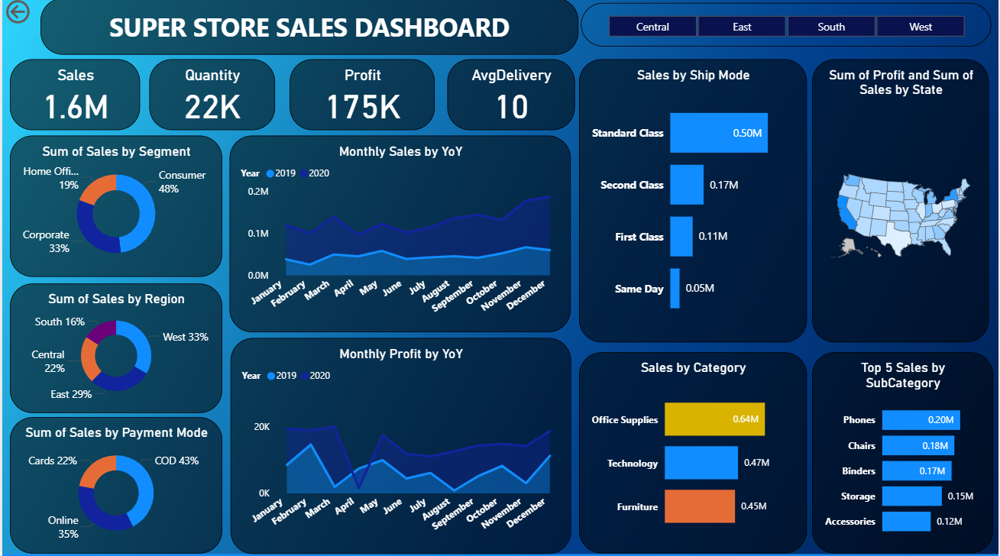
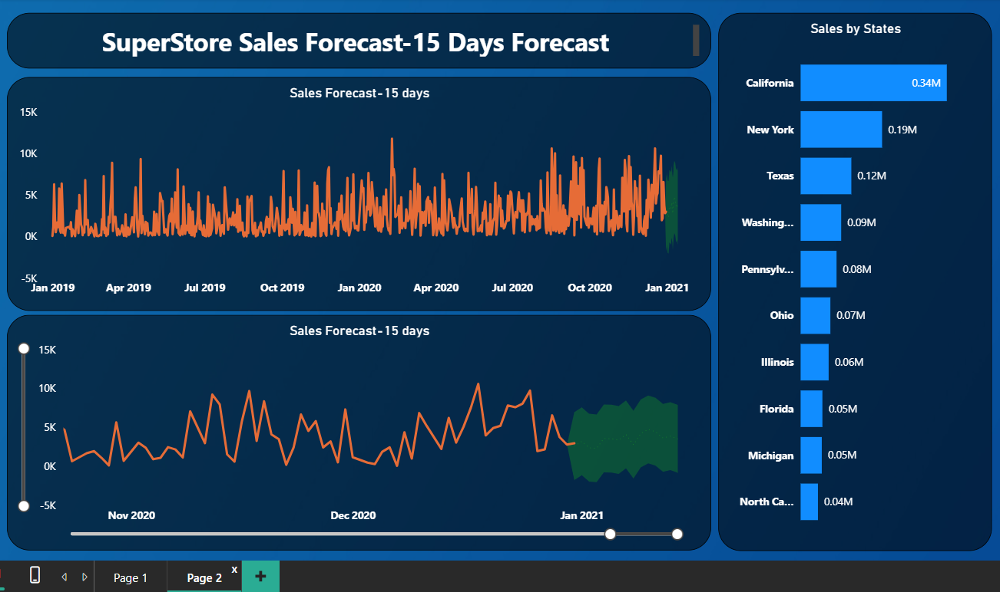

# SUPERSTORE-SALES-DASHBOARD
This project analyzes Superstore sales performance and creates a 15-day sales forecast using Power BI. It examines sales trends, regional performance, customer segments, shipping modes, top categories, and profit trends. The dashboard supports data-driven decisions and future planning.
## Introduction
Retail stores handle thousands of transactions daily, making it essential to track sales patterns, customer segments, regional contributions, and operational performance.
This project uses Power BI to build an interactive dashboard that visualizes sales, profit, quantity sold, shipping methods, and regional sales.
Additionally, a 15-day forecasting model was implemented to help predict future sales patterns for better business planning.
### The objective can be broken down into the following detailed components:
1. Dashboard Creation: Identify the KPIs, design an intuitive and visually appealing dashboard, add interactive visualizations and filtering capabilities to allow users to explore the data at various levels of granularity
2. Data analysis: Provide valuable insights to business entities regarding the effectiveness of their sales strategies through visualization and charts
3. Sales Forecasting: Leverage historic data and apply time series to generate sales forecasts for the next 15 days
4. Actionable Insights and Recommendations: The End goal is to share insights and actionable information that can drive strategic decision-making and support the supermarket’s goals for growth, efficiency, and customer satisfaction.
Learning
Incorporated data analysis techniques specializing in time series analysis to deliver valuable insights, accurate sales forecasting, and interactive dashboard creation, driving business success.
### Tools and Technologies Used
- Power BI Desktop
- Power Query
- DAX Measures
- Time Series Forecasting (Power BI analytics)
- Data Modeling
- Visualization Tools
### Dataset Description
The dataset includes:
- Sales, Profit, Quantity
- Order Date & Shipping Date
- Region & State
- Segment (Corporate, Consumer, Home Office)
- Category & Sub-category
- Payment Mode
- Ship Mode
### Dashboard Pages

[Interact with the live Dashboard here](https://app.powerbi.com/groups/me/reports/76bd7b74-3cd0-46cb-926e-045fd1c9098a/0322d9acd7d6ab2c88ae?experience=power-bi)

PAGE 1 – Sales Performance Dashboard
Key Insights
Overall Performance
- Total Sales: $1.6M
- Total Quantity: 22K items sold
- Total Profit: $175K
- Average Delivery Time: 10 days
Sales by Segment
- Consumer segment dominates sales at 48%, showing strong customer demand.
- Corporate (33%) and Home Office (19%) follow behind.
Sales by Region
- The West region leads with 33% of total sales.
- East (29%), Central (22%), and South (16%) trail behind.
Sales by Payment Mode
- Cash on Delivery (COD) represents the highest share at 43%.
- Online Payments: 35%
- Cards: 22%
#### This indicates customers trust COD more in this market.
### Monthly YoY Sales Trend
- 2020 sales consistently outperform 2019.
- Highest sales occur around November–December due to seasonal demand.
### Monthly YoY Profit Trend
- Profit also shows improved performance in 2020, despite fluctuations.
- Significant dip around April (possible economic effects).
### Sales by Ship Mode
- Standard Class accounts for the highest sales ($0.50M).
- Same-day deliveries have the lowest share ($0.05M).
#### This implies customers prefer cheaper shipping methods.
### Top Categories
- Office Supplies: $0.64M
- Technology: $0.47M
- Furniture: $0.45M
### Top 5 Sub-Categories
1.	Phones – $0.20M
2.	Chairs – $0.18M
3.	Binders – $0.17M
4.	Storage – $0.15M
5.	Accessories – $0.12M
#### Phones lead significantly in retail demand.
# PAGE 2 – 15-Day Sales Forecast Dashboard

[Interact with the live Dashboard here](https://app.powerbi.com/groups/me/reports/76bd7b74-3cd0-46cb-926e-045fd1c9098a/79242ced7966d9ee4901?experience=power-bi)

15-Day Forecast Insight
Using the Power BI forecasting model:
- Future trend shows a stable but mildly increasing sales pattern.
- Despite fluctuations in historical data, sales are projected to remain positive.
- The forecast band (green shaded area) shows expected variation, helping with demand planning.
### Sales by State
Top performing states:
- California: $0.34M (Highest)
- New York: $0.19M
- Texas: $0.12M
- Washington: $0.09M
- Pennsylvania: $0.08M
#### California is the major revenue driver for the business.
# DAX Measures Used (Summary)
•	Total Sales
•	Total Profit
•	Total Quantity
•	YoY Sales
•	YoY Profit
•	Average Delivery Time
•	Top N Sales Categories
## Business Impact
This dashboard helps decision-makers to:
- Understand customer buying patterns
- Optimize inventory for fast-moving items
- Allocate resources effectively across regions
- Improve marketing campaigns in high-performing states
- Strengthen shipping strategies to reduce delivery time
- Predict upcoming sales for better planning
## Conclusion
The SuperStore Sales Dashboard provides a clear and interactive view of the company’s key sales metrics.
It highlights product performance, regional contributions, profit behavior, customer segments, and shipping trends.
The forecasting model enables proactive planning and supports data-driven decision-making.
## Recommendations
1.	Increase stock for high-demand products like Phones, Chairs, and Binders.
2.	Improve delivery systems to reduce the 10-day average delivery time.
3.	Boost marketing in high-performing states like California and New York.
4.	Expand online payment incentives to reduce COD dependency.
5.	Negotiate better shipping contracts to make faster shipping affordable.
6.	Focus on the West and East regions, where the highest sales occur.
7.	Monitor month-to-month dips to understand seasonal behavior.

## 👨‍💻 Author
### Folagbade Olatunbosun Samuel
- 💼 LinkedIn:https://www.linkedin.com/in/olatunbosun-folagbade-559151243/
- 📧 Email:Folagbadeolatunbosun@gmail.com

